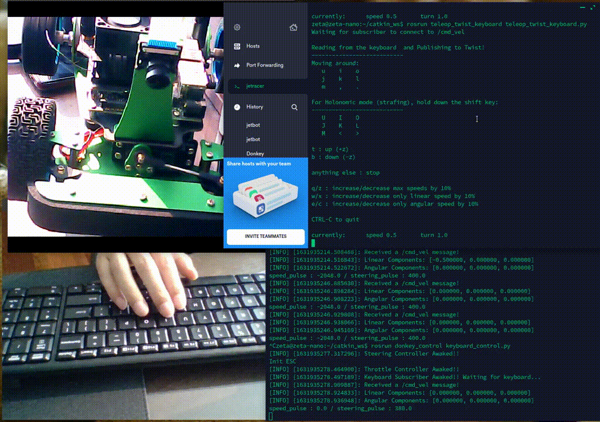
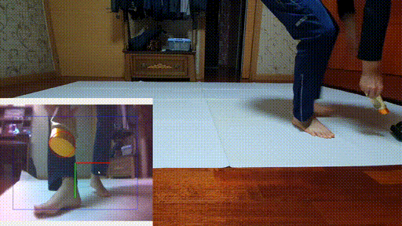

# Monicar I 

## AI RC Car with ROS2 Galactic + OpenCV + Yolo4-tiny

Base code: https://github.com/Road-Balance/donkey_ros      

There's Notion Lecture Notes but, It's written in Korean. 
Anyway, Here's the link

* [Notion Lecture Notes] https://zeta7.notion.site/JessiCar-1449b3fd5c984bab816920cb2b92002d

## Tested System information

**Jetson Nano 4GB or 2GB + IMX219 160 CSI camera**
* Jetpack 4.5.1
* Ubuntu 20.24
* ROS2 Galactic
* Opencv3.4.6 downgrade for darknet_ros

## Packages with Brief Explanation

``` 
├── monicar_control => Control RC Car with Adafruit PCA9685
├── monicar_cv => Computer Vision Package with Opencv4,Handling Image data For IMX219 Camera 
├── monicar_teleop => Publish cmd_vel from keyboard/gamepad
│
(...)
├── Images
├── LICENSE
├── README.md
```

## Prerequisite
Clone these Repo

```bash
$ cd ~/ros2_ws/src

monicar project code   
$ git clone https://github.com/zeta0707/monicar.git   

darknet_ros
$ git clone --recursive https://github.com/zeta0707/darknet_ros_fp16.git
$ darknet_ros_fp16/darknet_ros/rm_darknet_CMakeLists.sh
```

## Run script for selecting RCcar type
```bash
./carSelect.sh 
Usage: ./carSelect.sh target
target: select one among these
jetracer, jetbot, motorhat2wheel, motorhatSteer, nuriBldc, 298n2Wheel, pca9685Steer 
```

if you select waveshare jetracer
```bash
$ cd ~/catkin_ws/src/monicar/script
$ ./jetRccarParam.sh jetracer
```

## Run script for selecting Camera type
```bash
./camSelect.sh
Usage: ./camSelect.sh target
target: select one between these
csicam, usbcam
```

if you select usb caemra, run below command.
```bash
$ cd ~/ros2_ws/src/monicar/script
$ ./camSelect.sh usbcam
```

## Run script for selecting Jetson board type
```bash
./boardSelect.sh 
Usage: ./boardSelect.sh target
target: select one between these
orin, nano
```

if you select orin nano, run below command.
```bash
$ cd ~/ros2_ws/src/monicar/script
$ ./boardSelect.sh orin
```

## Usage

### 1. **monicar_camera package**

Packages for Image Streaming

> Check Camera Connection First!!!

**Using Gstreamer for CSI camera**
```bash
gst-launch-1.0 nvarguscamerasrc sensor_id=0 ! \
   'video/x-raw(memory:NVMM),width=3280, height=2464, framerate=21/1, format=NV12' ! \
   nvvidconv flip-method=0 ! 'video/x-raw,width=960, height=720' ! \
   nvvidconv ! nvegltransform ! nveglglessink -e
```

* `sensor_id` : this value depends on Camera Slot in Jetson Nano.

**Using ROS python**

```bash
#if csi camera
$ ros2 launch monicar_cv csicam.launch.py
# if usb camera
$ ros2 launch monicar_cv usbcam.launch.py

# terminal #2
$ ros2 run rqt_image_view rqt_image_view
```

### 2. **monicar_control package**

Packages for controlling `RC Car` with `PCA9685` PWM driver.
You need to install `Adafruit_PCA9685` python package first 

There's four modes for controlling RC Car

* JoyStick Control
* Keyboard Control
* Blob, Yolo4 Control
* React to traffic signal 

### 3. **monicar_joy package**

There's two modes for using joystick 
* Button mode- delete Button mode

* Axes mode

### 4. **monicar_cv package**

Packages for OpenCV applications

* Find Blob with Certain color

## Application

### **1. joy_control**

Control RC Car with game controller

<p align="center">
    
</p>

```bash
#jetson
$ ros2 launch monicar_control motor.launch.py
#jetson
$ ros2 launch monicar_teleop teleop_joy.launch.py

```

### **2. keyboard_control**

Control RC Car with keyboard

<p align="center">
    
</p>

```bash
#jetson
$ ros2 launch monicar_control motor.launch.py
#jetson or PC
$ ros2 run monicar_teleop teleop_keyboard

```

### **3. blob_tracking**

Find the any color box of the Jetson Nano on the screen and change the direction of the wheel accordingly.

<p align="center">
    
</p>


```bash
# Jetson
$ ros2 launch monicar_control blob_all.launch.py
```

Debugging with `rqt_image_view`

```bash
# Jetson, but PC is better
ros2 run rqt_image_view rqt_image_view
```

### **4. Yolo4_tracking**

Find the object of the Jetson Nano on the screen and change the direction of the wheel accordingly.


<p align="center">
    
</p>


```bash
#terminal #1
# object detect using Yolo_v4
$ ros2 launch darknet_ros yolov4-tiny.launch.py

#terminal #2
# camera publish, object x/y -> car move
$ ros2 launch monicar_control yolo_all.launch.py 
```

### **5. Yolo4 traffic signal**

Train traffic signal, then Jetson nano will react to the traffic signal


```bash
#terminal #1
# object detect using Yolo_v4
$ ros2 launch darknet_ros yolov4-monicar.launch.py

#terminal #2
# camera publish, object -> start, stop, turn left, turn left
$ ros2 launch monicar_control traffic_all.launch.py
```
